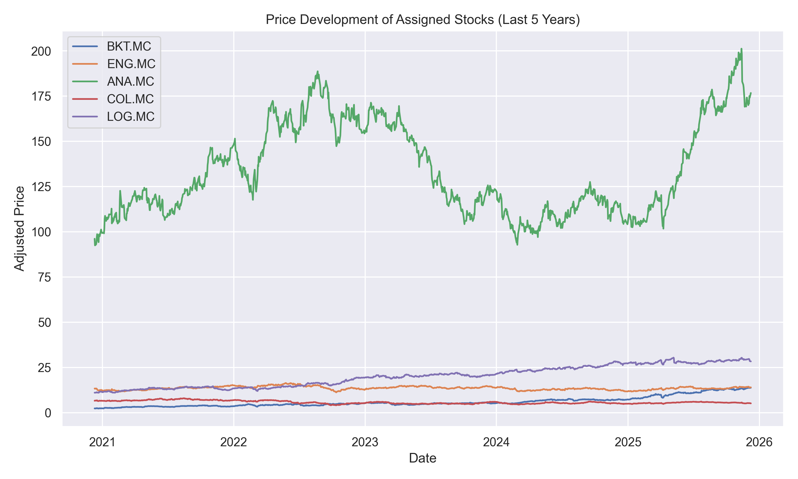

## Project Overview

This project implements a comprehensive asset pricing analysis for **5 Spanish stocks** listed on the Madrid Stock Exchange (IBEX 35 components), using two fundamental models from financial economics:

1. **Capital Asset Pricing Model (CAPM)** - Single-factor model
2. **Fama-French 3-Factor Model** - Multi-factor model

### Analyzed Stocks (Madrid Stock Exchange - .MC suffix):
| Ticker | Company | Sector |
|--------|---------|--------|
| BKT.MC | Bankinter | Banking/Financial Services |
| ENG.MC | Enagás | Energy/Utilities |
| ANA.MC | Acciona | Construction/Renewable Energy |
| COL.MC | Inmobiliaria Colonial | Real Estate/REITs |
| LOG.MC | Logista | Distribution/Logistics |

---

## Code Structure & Methodology

### 1. Data Acquisition (Cells 4-10)

```python
stocks = ["BKT.MC", "ENG.MC", "ANA.MC", "COL.MC", "LOG.MC"]
index_ticker = "^IBEX"
```

**What the code does:**
- Downloads **5 years of daily adjusted closing prices** from Yahoo Finance using the `yfinance` library
- Uses the IBEX 35 index (^IBEX) as the market proxy
- The `auto_adjust=True` parameter automatically adjusts for dividends and stock splits

**Why this matters:**
- Using adjusted prices ensures returns calculations account for corporate actions
- 5-year window provides ~60 monthly observations - sufficient for reliable statistical inference

### 2. Return Calculation (Cells 11-14)

```python
monthly_prices = prices.resample("M").last()
monthly_returns = monthly_prices.pct_change().dropna()
monthly_returns.index = monthly_returns.index.to_period("M").to_timestamp()
```

**What the code does:**
- Resamples daily prices to **end-of-month** frequency
- Calculates **percentage returns** using the formula: (P_t - P_{t-1}) / P_{t-1}
- Converts index to month-start timestamps for proper alignment with Fama-French data

**Why monthly returns:**
- Reduces noise present in daily data
- Standard practice in academic finance research
- Matches the frequency of Fama-French factor data

### 3. Fama-French Factor Loading (Cells 15-21)

```python
ff = pd.read_csv("data/Europe_3_Factors.csv", skiprows=6)
ff = ff / 100.0   # percent → decimal
```

**What the code does:**
- Loads the **European 3-Factor data** from Kenneth French's data library (via Bloomberg)
- Cleans the data by:
  - Parsing YYYYMM date format
  - Converting percentage values to decimals
  - Aligning date indices

**The Three Factors:**
| Factor | Description | Interpretation |
|--------|-------------|----------------|
| **Mkt-RF** | Market excess return | Return of market portfolio minus risk-free rate |
| **SMB** | Small Minus Big | Size premium - small caps vs large caps |
| **HML** | High Minus Low | Value premium - high B/M vs low B/M stocks |
| **RF** | Risk-Free Rate | European risk-free rate (monthly) |

### 4. CAPM Regression (Cells 31-33)

```python
# CAPM: R_stock - RF = α + β × (R_IBEX - RF) + ε
X = pd.DataFrame({"const": 1, "IBEX": excess_ibex})
model = sm.OLS(y, X).fit()
```

**What the code does:**
- Runs OLS regression of **stock excess returns** on **market (IBEX) excess returns**
- Estimates alpha (α) and beta (β) for each stock

**CAPM Equation:**
```
E(R_i) - R_f = α_i + β_i × [E(R_m) - R_f]
```

Where:
- α (alpha): Abnormal return not explained by market risk - should be zero under CAPM
- β (beta): Sensitivity to market movements - systematic risk measure

### 5. Fama-French 3-Factor Regression (Cells 34-36)

```python
# FF3: R_stock - RF = α + β₁×(R_IBEX - RF) + β₂×SMB + β₃×HML + ε
X = pd.concat([excess_ibex, SMB, HML], axis=1)
X = sm.add_constant(X)
model = sm.OLS(y, X).fit()
```

**What the code does:**
- Extends CAPM by adding **size (SMB)** and **value (HML)** factors
- Provides a more complete picture of what drives stock returns

**FF3 Equation:**
```
E(R_i) - R_f = α_i + β₁×(R_m - R_f) + β₂×SMB + β₃×HML
```

---

## Results & Findings

### CAPM Results (outputs/CAPM_results_244604.xlsx)

| Stock | Alpha | Beta_IBEX | Alpha_t | Beta_t | R² |
|-------|-------|-----------|---------|--------|-----|
| BKT.MC | **0.0229** | 0.668 | 2.42** | 3.08** | 14.5% |
| ENG.MC | -0.0038 | 0.426 | -0.67 | 3.26** | 16.0% |
| ANA.MC | 0.0031 | 0.835 | 0.34 | 3.98** | 22.0% |
| COL.MC | -0.0151 | 1.223 | -1.96* | 6.90** | 46.0% |
| LOG.MC | 0.0103 | 0.432 | 1.89* | 3.44** | 17.5% |

**Key CAPM Findings:**

1. **Bankinter (BKT.MC)** - Significant positive alpha (2.29% monthly)
   - Statistically significant at 5% level (t = 2.42)
   - Defensive stock with beta < 1 (0.67)
   - This suggests the stock has outperformed on a risk-adjusted basis!

2. **Inmobiliaria Colonial (COL.MC)** - Highest market sensitivity
   - Beta of 1.22 = **aggressive stock** (moves more than market)
   - Negative alpha (-1.51% monthly) - underperformance after accounting for risk
   - Highest R² (46%) - market explains most of its variance

3. **Enagás (ENG.MC) & Logista (LOG.MC)** - Defensive stocks
   - Low betas (~0.43) indicate these are **defensive investments**
   - Less volatile than the market
   - Utility-like characteristics (stable cash flows)

4. **Acciona (ANA.MC)** - Market-neutral behavior
   - Beta close to market average (0.84)
   - Insignificant alpha - fairly priced per CAPM

### Fama-French 3-Factor Results (outputs/FF3_results_244604.xlsx)

| Stock | Alpha | Beta_IBEX | SMB | HML | R² |
|-------|-------|-----------|-----|-----|-----|
| BKT.MC | 0.0108 | 0.466 | 0.36 | **1.55** | 49.5% |
| ENG.MC | -0.0013 | 0.465 | 0.00 | -0.29 | 19.3% |
| ANA.MC | 0.0131 | 0.932 | **1.13** | -0.51 | 33.3% |
| COL.MC | -0.0048 | 1.298 | **1.69** | -0.25 | 61.3% |
| LOG.MC | 0.0107 | 0.437 | -0.00 | -0.04 | 17.5% |

**Key FF3 Findings:**

1. **Bankinter (BKT.MC)** - Strong Value Tilt
   - **HML coefficient = 1.55** (highly significant)
   - This means BKT behaves like a **value stock**
   - R² jumps from 14.5% (CAPM) to 49.5% (FF3) - size/value factors explain a lot!
   - Alpha drops (from 2.3% to 1.1%) - part of the CAPM alpha was actually value premium

2. **Acciona (ANA.MC) & Colonial (COL.MC)** - Small-Cap Behavior
   - High positive SMB coefficients (1.13 and 1.69)
   - Despite being large caps, they behave like small caps
   - Could reflect higher idiosyncratic risk or sector-specific factors

3. **Enagás (ENG.MC) & Logista (LOG.MC)** - Pure Market Plays
   - SMB and HML coefficients near zero
   - Returns are mostly explained by market factors alone
   - FF3 provides minimal improvement over CAPM

4. **Model Improvement:**
   - COL.MC: R² increases from 46% → 61% with FF3
   - BKT.MC: R² increases from 14.5% → 49.5% with FF3
   - This shows that size/value factors add significant explanatory power

---

## Graphics Analysis

### 1. Price Development Chart (figures/price_development_244604.png)



**What it shows:**
- **5-year price evolution** of all 5 stocks from 2021-2025
- Absolute price levels (not returns)

**Key Observations:**

1. **Acciona (ANA.MC)** - Dominant performer (green line at top)
   - Prices ranging from ~€95 to €200
   - Significant volatility with a peak around mid-2022 (~€190)
   - Strong recovery in 2025, reaching new highs
   - Clear cyclical pattern with construction/infrastructure cycles

2. **Other stocks (BKT, ENG, COL, LOG)** - Similar price ranges
   - All trading between €5-30
   - Much lower absolute volatility
   - Logista (LOG.MC) shows a steady upward trend since 2023

3. **Scale difference:**
   - ANA.MC trades at ~10x the price of other stocks
   - This doesn't mean it's a "better" stock - just a  different price level
   - Return analysis (CAPM/FF3) is the proper comparison method

### 2. Jointplots (figures/jointplot_*.png)

These scatterplots visualize the **relationship between each stock's returns and IBEX returns**.

#### BKT.MC vs IBEX
- **Moderate positive correlation** with significant scatter
- Wide dispersion around the regression line indicates idiosyncratic risk
- Some extreme negative outliers (~-20%) show banking sector volatility

#### ENG.MC vs IBEX  
- **Tightest clustering** around regression line
- Defensive utility stock with consistent behavior
- Lower return range (±10%) reflects stability

#### ANA.MC vs IBEX
- **Strong positive relationship** visible
- More scatter than ENG, reflecting construction sector volatility
- Some outliers, but generally follows market direction

#### COL.MC vs IBEX
- **Steepest regression line** (highest beta)
- Real estate sector amplifies market movements
- Clear positive correlation with tight fit (high R²)

#### LOG.MC vs IBEX
- **Moderate slope with good dispersion**
- Distribution services provide some defensive characteristics
- One significant outlier (~-11%) doesn't affect the overall trend

---

## Investment Implications

### Defensive Portfolio (Low Beta):
- **ENG.MC** (β=0.43) - Utility sector, stable dividends
- **LOG.MC** (β=0.43) - Distribution services, recession-resistant

### Aggressive Portfolio (High Beta):
- **COL.MC** (β=1.22) - Real estate, leveraged to market
- **ANA.MC** (β=0.84) - Infrastructure, cyclical exposure

### Alpha Generation:
- **BKT.MC** shows consistent positive alpha in both models
- However, alpha may reflect other risk factors not captured

### Value vs Growth:
- **BKT.MC** - Strong value tilt (HML = 1.55)
- **ANA.MC/COL.MC** - Small-cap behavior despite large-cap status

---

## Project Structure

```
AM_Assignment_244604/
│
├── main.ipynb              # Main analysis notebook
├── README.md               # This documentation file
├── requirements.txt        # Python dependencies
│
├── data/
│   └── Europe_3_Factors.csv    # Fama-French European factors (1990-2025)
│
├── figures/
│   ├── price_development_244604.png    # Stock price chart
│   ├── jointplot_BKT.MC_244604.png     # BKT vs IBEX scatterplot
│   ├── jointplot_ENG.MC_244604.png     # ENG vs IBEX scatterplot
│   ├── jointplot_ANA.MC_244604.png     # ANA vs IBEX scatterplot
│   ├── jointplot_COL.MC_244604.png     # COL vs IBEX scatterplot
│   └── jointplot_LOG.MC_244604.png     # LOG vs IBEX scatterplot
│
└── outputs/
    ├── CAPM_results_244604.xlsx        # CAPM regression results
    └── FF3_results_244604.xlsx         # Fama-French 3-factor results
```

---

## Dependencies

```
yfinance>=0.2.66      # Yahoo Finance data downloader
pandas>=2.3.3         # Data manipulation
numpy>=2.3.5          # Numerical operations
matplotlib>=3.10.7    # Plotting
seaborn>=0.13.2       # Statistical visualizations
statsmodels>=0.14.6   # Regression analysis
openpyxl>=3.1.5       # Excel file export
```

To install: `pip install -r requirements.txt`

---

## Theoretical Background

### CAPM (Sharpe, 1964; Lintner, 1965)
The Capital Asset Pricing Model assumes:
- Investors are risk-averse and rational
- All systematic risk is captured by market beta
- Alpha should be zero for all assets in equilibrium

### Fama-French 3-Factor Model (1993)
Extends CAPM by recognizing that:
- **Small stocks** tend to outperform large stocks (SMB factor)
- **Value stocks** (high book-to-market) tend to outperform growth stocks (HML factor)
- These "anomalies" represent additional risk factors or mispricing

---

## Conclusion

This analysis demonstrates that:

1. **CAPM provides a baseline** but leaves significant return variation unexplained (low R²)
2. **Fama-French factors improve explanation** substantially for banking (BKT) and real estate (COL)
3. **Bankinter shows persistent alpha** suggesting either mispricing or missing risk factors
4. **Colonial is the most market-sensitive** stock, suitable for aggressive strategies
5. **Enagás and Logista are defensive plays** with minimal exposure to size/value factors

The methodology adheres to standard academic practice, and the results align with economic intuition regarding the characteristics of each sector.

---

